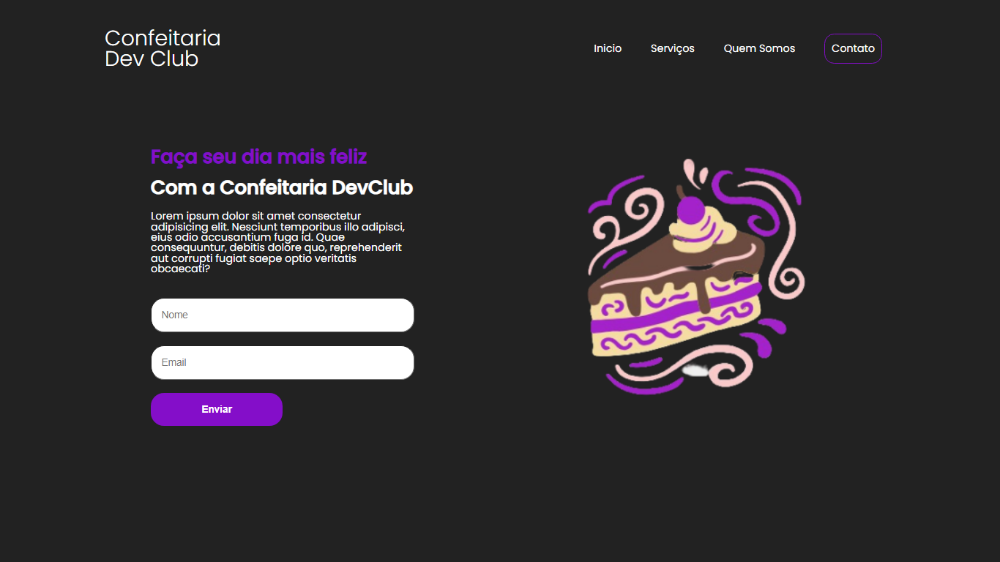

# Landing Page de uma confeitaria

Este é o repositório do projeto da Confeitaria Dev Club, um site fictício para uma confeitaria.

## Descrição

Este projeto consiste em um site de uma confeitaria fictícia, desenvolvido como parte de um estudo de desenvolvimento web. O site inclui informações sobre a confeitaria, seus serviços e como entrar em contato.

## Tecnologias Utilizadas

- HTML5
- CSS3
- Google Fonts

## Como Usar

1. Faça o download ou clone este repositório.
2. Abra o arquivo `index.html` em seu navegador.

## Autor
Angelo Hervis
- GitHub: [AngeloHervis](https://github.com/AngeloHervis)
- LinkedIn: [Angelo Hervis](https://www.linkedin.com/in/angelo-hervis/)
